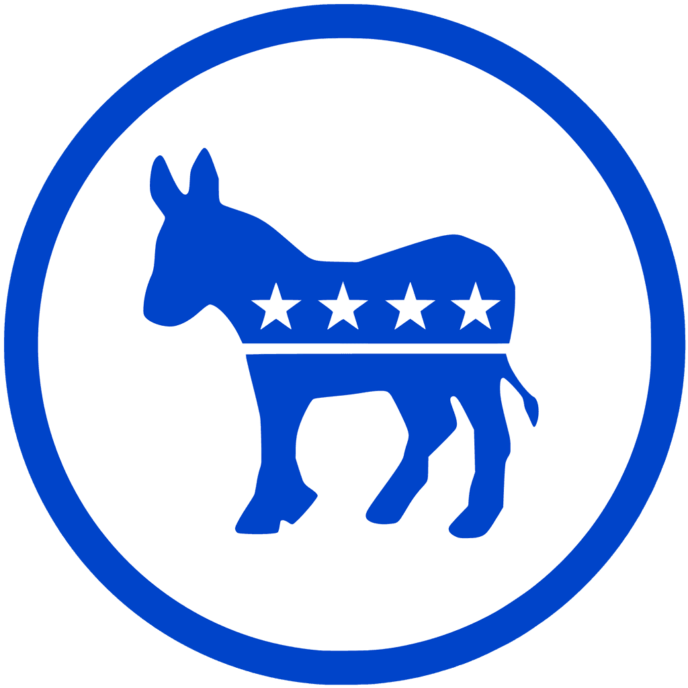
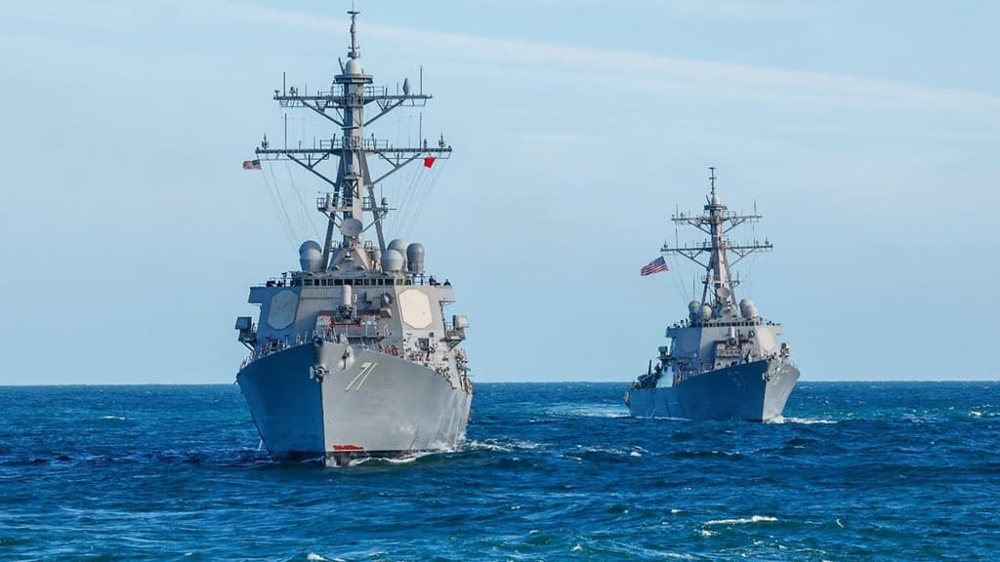
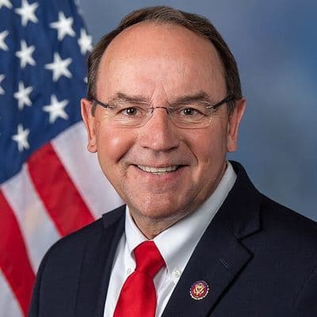
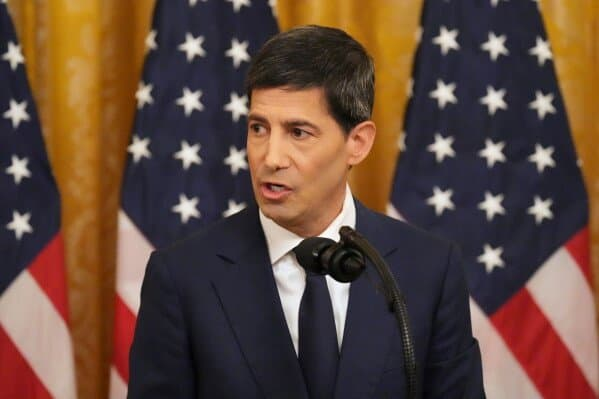
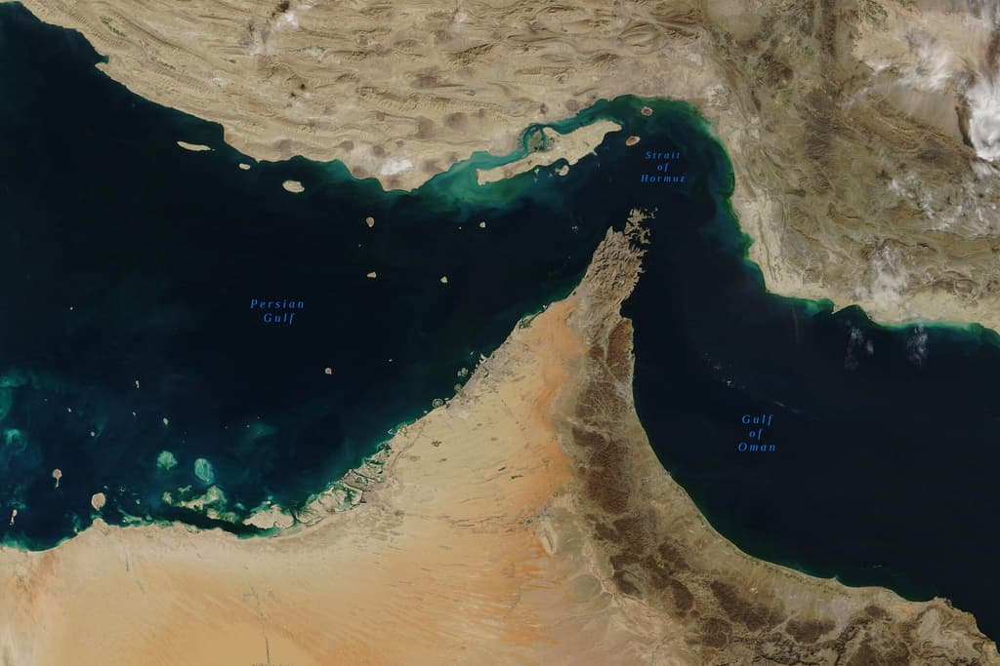
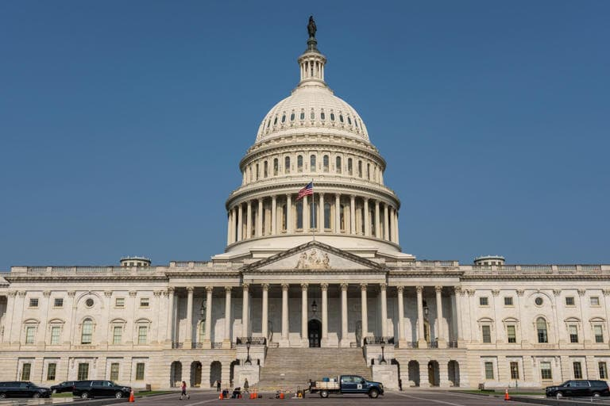
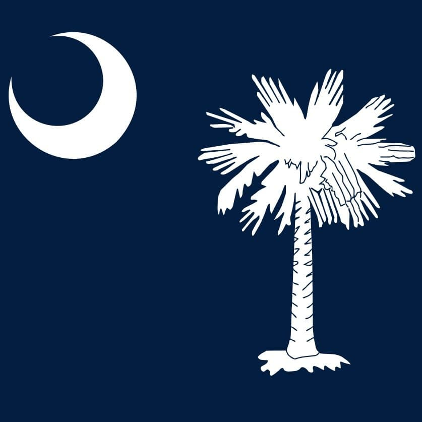
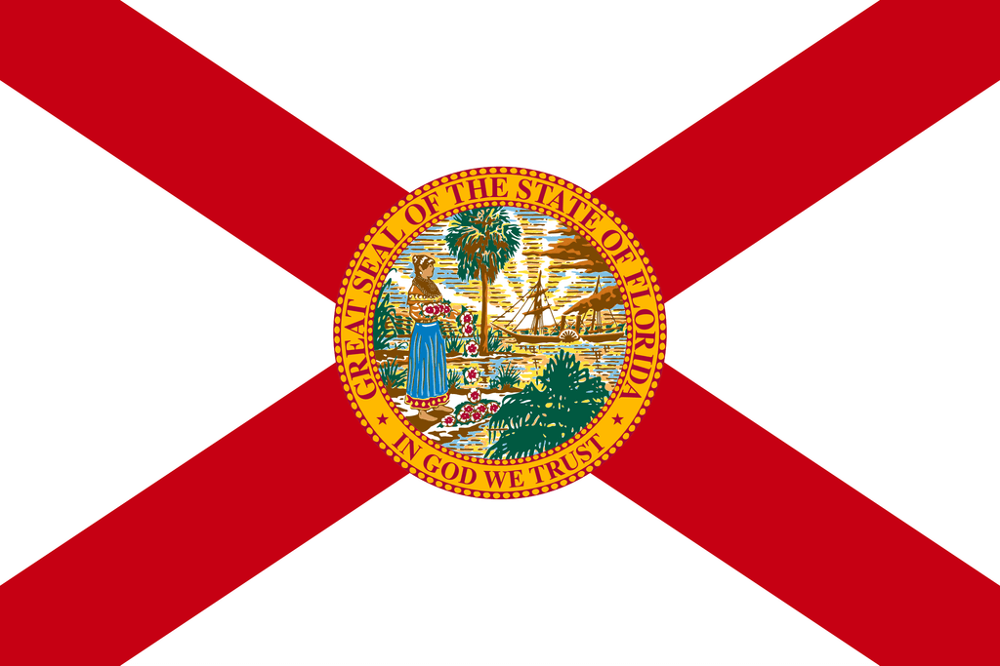
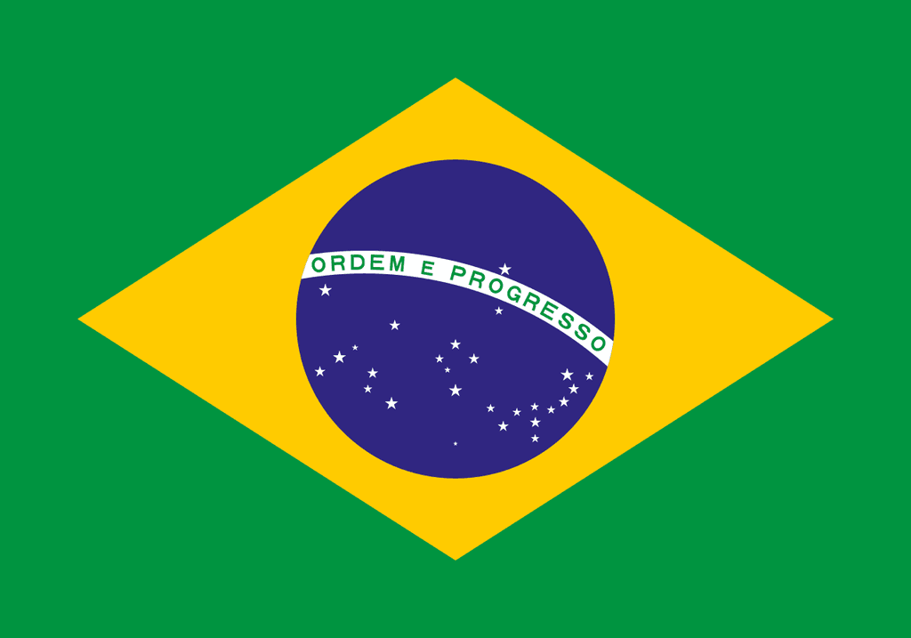
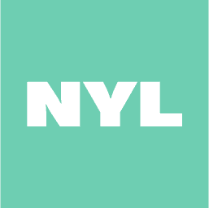

# Polymarket | O Maior Mercado de Previsões do Mundo™
> 原文链接: https://polymarket.com

---

# Polymarket | O Maior Mercado de Previsões do Mundo™

## Mercados em destaque

### [Islam Makhachev vs. Ian Machado Garry](https://polymarket.com/pt/event/ufc-isl-ian1-2026-08-15)

[Desporto](https://polymarket.com/pt/sports/live)·[Combat](https://polymarket.com/pt/sports/mma)·[UFC](https://polymarket.com/pt/sports/ufc/games)

### [Islam Makhachev vs. Ian Machado Garry](https://polymarket.com/pt/event/ufc-isl-ian1-2026-08-15)

[Desporto](https://polymarket.com/pt/sports/live)·[Combat](https://polymarket.com/pt/sports/mma)·[UFC](https://polymarket.com/pt/sports/ufc/games)

[Islam

](https://polymarket.com/pt/event/ufc-isl-ian1-2026-08-15?outcomeIndex=0)[Ian Machado

](https://polymarket.com/pt/event/ufc-isl-ian1-2026-08-15?outcomeIndex=1)

Total

0.5

1.5

2.5

3.5

4.5

[O 4.5](https://polymarket.com/pt/event/ufc-isl-ian1-2026-08-15?marketSlug=ufc-isl-ian1-2026-08-15-totals-4pt5&outcomeIndex=0)[U 4.5](https://polymarket.com/pt/event/ufc-isl-ian1-2026-08-15?marketSlug=ufc-isl-ian1-2026-08-15-totals-4pt5&outcomeIndex=1)

[

Islam Makhachev](https://polymarket.com/pt/teams/ufc/islam-makhachev)

22:00agosto 15

[

Ian Machado Garry](https://polymarket.com/pt/teams/ufc/ian-machado-garry)

\+ $1

\+ $1

\+ $3

\+ $1

\+ $50

$3M Vol

### [Candidato presidencial democrata 2028](https://polymarket.com/pt/event/democratic-presidential-nominee-2028)

[Eleições](https://polymarket.com/pt/dashboards/global-elections)·[Eleições Mundiais](https://polymarket.com/pt/predictions/world-elections)

[

Alexandria Ocasio-Cortez

20%](https://polymarket.com/pt/event/democratic-presidential-nominee-2028/will-alexandria-ocasio-cortez-win-the-2028-democratic-presidential-nomination-653)[

Gavin Newsom

16%](https://polymarket.com/pt/event/democratic-presidential-nominee-2028/will-gavin-newsom-win-the-2028-democratic-presidential-nomination-568)[

Jon Ossoff

15%](https://polymarket.com/pt/event/democratic-presidential-nominee-2028/will-jon-ossoff-win-the-2028-democratic-presidential-nomination-885)[

Kamala Harris

7%](https://polymarket.com/pt/event/democratic-presidential-nominee-2028/will-kamala-harris-win-the-2028-democratic-presidential-nomination-641)

[

CKAB

Dollars on sale for 28c. It's so glaringly, blatantly obvious that Newsom wins in 2028 and 2032. Anyone who can't see this one coming from a mile away is deaf, dumb and blind.

](https://polymarket.com/pt/event/democratic-presidential-nominee-2028)[

boogz

nah the fact his name sounds like NewSCUM makes it practically impossible xd

](https://polymarket.com/pt/event/democratic-presidential-nominee-2028)[

lmg743

Anyone who claims the dem candidate is "obvious" at this stage is an idiot

](https://polymarket.com/pt/event/democratic-presidential-nominee-2028)[

bet25225

ngl I just think the one who is gonna win democrats over is gonna be the person who fights and picks their battles with republicans well. Basically the person who is able to actually able to affectively combat the opposing side. I am ngl we have had good people with decent policy but we haven't had anybody in a while who can debate well. Newsom is definitely that so far.

](https://polymarket.com/pt/event/democratic-presidential-nominee-2028)[

beruofc

The Rock having more votes than Kamala Harris is sending me 🤣🤣🤣

](https://polymarket.com/pt/event/democratic-presidential-nominee-2028)[

BeezoDokiDoki

\[link removed\]

](https://polymarket.com/pt/event/democratic-presidential-nominee-2028)[

CKAB

Dollars on sale for 28c. It's so glaringly, blatantly obvious that Newsom wins in 2028 and 2032. Anyone who can't see this one coming from a mile away is deaf, dumb and blind.

](https://polymarket.com/pt/event/democratic-presidential-nominee-2028)[

boogz

nah the fact his name sounds like NewSCUM makes it practically impossible xd

](https://polymarket.com/pt/event/democratic-presidential-nominee-2028)[

lmg743

Anyone who claims the dem candidate is "obvious" at this stage is an idiot

](https://polymarket.com/pt/event/democratic-presidential-nominee-2028)[

bet25225

ngl I just think the one who is gonna win democrats over is gonna be the person who fights and picks their battles with republicans well. Basically the person who is able to actually able to affectively combat the opposing side. I am ngl we have had good people with decent policy but we haven't had anybody in a while who can debate well. Newsom is definitely that so far.

](https://polymarket.com/pt/event/democratic-presidential-nominee-2028)[

beruofc

The Rock having more votes than Kamala Harris is sending me 🤣🤣🤣

](https://polymarket.com/pt/event/democratic-presidential-nominee-2028)[

BeezoDokiDoki

\[link removed\]

](https://polymarket.com/pt/event/democratic-presidential-nominee-2028)[

CKAB

Dollars on sale for 28c. It's so glaringly, blatantly obvious that Newsom wins in 2028 and 2032. Anyone who can't see this one coming from a mile away is deaf, dumb and blind.

](https://polymarket.com/pt/event/democratic-presidential-nominee-2028)[

boogz

nah the fact his name sounds like NewSCUM makes it practically impossible xd

](https://polymarket.com/pt/event/democratic-presidential-nominee-2028)[

lmg743

Anyone who claims the dem candidate is "obvious" at this stage is an idiot

](https://polymarket.com/pt/event/democratic-presidential-nominee-2028)[

bet25225

ngl I just think the one who is gonna win democrats over is gonna be the person who fights and picks their battles with republicans well. Basically the person who is able to actually able to affectively combat the opposing side. I am ngl we have had good people with decent policy but we haven't had anybody in a while who can debate well. Newsom is definitely that so far.

](https://polymarket.com/pt/event/democratic-presidential-nominee-2028)[

beruofc

The Rock having more votes than Kamala Harris is sending me 🤣🤣🤣

](https://polymarket.com/pt/event/democratic-presidential-nominee-2028)[

BeezoDokiDoki

\[link removed\]

](https://polymarket.com/pt/event/democratic-presidential-nominee-2028)

$1B Vol

Termina em nov 7, 2028·

### [IPO antrópico por \_\_?](https://polymarket.com/pt/event/anthropic-ipo-by)

[Finanças](https://polymarket.com/pt/finance)·[IPOs](https://polymarket.com/pt/predictions/ipos)

[

15 de setembro de 2026

2%](https://polymarket.com/pt/event/anthropic-ipo-by/will-anthropic-ipo-by-september-15-2026-415)[

30 de setembro de 2026

12%](https://polymarket.com/pt/event/anthropic-ipo-by/will-anthropic-ipo-by-september-30-2026-733)[

31 de outubro de 2026

68%](https://polymarket.com/pt/event/anthropic-ipo-by/will-anthropic-ipo-by-october-31-2026)[

31 de dezembro de 2026

83%](https://polymarket.com/pt/event/anthropic-ipo-by/will-anthropic-ipo-by-december-31-2026-546-128)

[

Bloomberg.com

・1d atrás

Anthropic Revenue Surges to Over $11.5 Billion in Second Quarter

](https://polymarket.com/pt/event/anthropic-ipo-by)[

WSJ

・4d atrás

Anthropic Tries to Shore Up Investor Confidence Ahead of Blockbuster IPO

](https://polymarket.com/pt/event/anthropic-ipo-by)[

Reuters

・1d atrás

China's Z.ai says new model nears Anthropic's Mythos 5 in cyber-defence tests

](https://polymarket.com/pt/event/anthropic-ipo-by)[

The New York Times

・2d atrás

Inside the $12.5 Billion Deal for the Lakers

](https://polymarket.com/pt/event/anthropic-ipo-by)[

Bloomberg.com

・1d atrás

Anthropic Revenue Surges to Over $11.5 Billion in Second Quarter

](https://polymarket.com/pt/event/anthropic-ipo-by)[

WSJ

・4d atrás

Anthropic Tries to Shore Up Investor Confidence Ahead of Blockbuster IPO

](https://polymarket.com/pt/event/anthropic-ipo-by)[

Reuters

・1d atrás

China's Z.ai says new model nears Anthropic's Mythos 5 in cyber-defence tests

](https://polymarket.com/pt/event/anthropic-ipo-by)[

The New York Times

・2d atrás

Inside the $12.5 Billion Deal for the Lakers

](https://polymarket.com/pt/event/anthropic-ipo-by)[

Bloomberg.com

・1d atrás

Anthropic Revenue Surges to Over $11.5 Billion in Second Quarter

](https://polymarket.com/pt/event/anthropic-ipo-by)[

WSJ

・4d atrás

Anthropic Tries to Shore Up Investor Confidence Ahead of Blockbuster IPO

](https://polymarket.com/pt/event/anthropic-ipo-by)[

Reuters

・1d atrás

China's Z.ai says new model nears Anthropic's Mythos 5 in cyber-defence tests

](https://polymarket.com/pt/event/anthropic-ipo-by)[

The New York Times

・2d atrás

Inside the $12.5 Billion Deal for the Lakers

](https://polymarket.com/pt/event/anthropic-ipo-by)

$2M Vol

Termina em jul 1, 2027·

### [Equilíbrio de Poder: Médio Prazo 2026](https://polymarket.com/pt/event/balance-of-power-2026-midterms)

[Política](https://polymarket.com/pt/politics)·[Eleições Nos EUA](https://polymarket.com/pt/predictions/us-presidential-election)

[

Democratas Vencem Tudo

50%](https://polymarket.com/pt/event/balance-of-power-2026-midterms/2026-balance-of-power-d-senate-d-house-949)[

Senado D, Câmara R

1%](https://polymarket.com/pt/event/balance-of-power-2026-midterms/2026-balance-of-power-d-senate-r-house-692)[

Senado R, Câmara D

38%](https://polymarket.com/pt/event/balance-of-power-2026-midterms/2026-balance-of-power-r-senate-d-house-444)[

Republicanos Varridos

14%](https://polymarket.com/pt/event/balance-of-power-2026-midterms/2026-balance-of-power-r-senate-r-house-537)

[

The New York Times

・11h atrás

Opinion | How Are the Democrats’ Midterm Dreams Shaping Up?

](https://polymarket.com/pt/event/balance-of-power-2026-midterms)[

The Washington Post

・1d atrás

Opinion | Adam Schiff’s court-packing brainstorm

](https://polymarket.com/pt/event/balance-of-power-2026-midterms)[

WSJ

・5d atrás

Mark Zuckerberg Lays Out New AI Vision in 6,500-Word Essay

](https://polymarket.com/pt/event/balance-of-power-2026-midterms)[

Reuters

・3d atrás

India, Southern African customs bloc revive trade pact talks

](https://polymarket.com/pt/event/balance-of-power-2026-midterms)[

AP News

・1d atrás

Trump focuses on violent crime reduction as he boosts GOP candidates at New York police academy

](https://polymarket.com/pt/event/balance-of-power-2026-midterms)[

The New York Times

・11h atrás

Opinion | How Are the Democrats’ Midterm Dreams Shaping Up?

](https://polymarket.com/pt/event/balance-of-power-2026-midterms)[

The Washington Post

・1d atrás

Opinion | Adam Schiff’s court-packing brainstorm

](https://polymarket.com/pt/event/balance-of-power-2026-midterms)[

WSJ

・5d atrás

Mark Zuckerberg Lays Out New AI Vision in 6,500-Word Essay

](https://polymarket.com/pt/event/balance-of-power-2026-midterms)[

Reuters

・3d atrás

India, Southern African customs bloc revive trade pact talks

](https://polymarket.com/pt/event/balance-of-power-2026-midterms)[

AP News

・1d atrás

Trump focuses on violent crime reduction as he boosts GOP candidates at New York police academy

](https://polymarket.com/pt/event/balance-of-power-2026-midterms)[

The New York Times

・11h atrás

Opinion | How Are the Democrats’ Midterm Dreams Shaping Up?

](https://polymarket.com/pt/event/balance-of-power-2026-midterms)[

The Washington Post

・1d atrás

Opinion | Adam Schiff’s court-packing brainstorm

](https://polymarket.com/pt/event/balance-of-power-2026-midterms)[

WSJ

・5d atrás

Mark Zuckerberg Lays Out New AI Vision in 6,500-Word Essay

](https://polymarket.com/pt/event/balance-of-power-2026-midterms)[

Reuters

・3d atrás

India, Southern African customs bloc revive trade pact talks

](https://polymarket.com/pt/event/balance-of-power-2026-midterms)[

AP News

・1d atrás

Trump focuses on violent crime reduction as he boosts GOP candidates at New York police academy

](https://polymarket.com/pt/event/balance-of-power-2026-midterms)

$10M Vol

Termina em nov 3, 2026·

### [EUA anunciam fim do bloqueio iraniano por...?](https://polymarket.com/pt/event/us-announces-end-of-iranian-blockade-byptptpt-20260713152715080)

[Política](https://polymarket.com/pt/politics)·[Irão](https://polymarket.com/pt/predictions/iran)

[

31 de agosto

21%](https://polymarket.com/pt/event/us-announces-end-of-iranian-blockade-byptptpt-20260713152715080/us-announces-end-of-iranian-blockade-by-august-31-2026-20260713152715084-642-513-584-641-939-632-729)[

30 de setembro

43%](https://polymarket.com/pt/event/us-announces-end-of-iranian-blockade-byptptpt-20260713152715080/us-announces-end-of-iranian-blockade-by-september-30-2026-20260727171615364-722-649-646-561-213-644)[

31 de outubro

62%](https://polymarket.com/pt/event/us-announces-end-of-iranian-blockade-byptptpt-20260713152715080/us-announces-end-of-iranian-blockade-by-october-31-2026-20260727171711632-895-372-622-413-171-454)[

31 de dezembro

79%](https://polymarket.com/pt/event/us-announces-end-of-iranian-blockade-byptptpt-20260713152715080/us-announces-end-of-iranian-blockade-by-december-31-2026-20260727171803489-375-949-645-919-269-157)

[

Reuters

・23h atrás

Hormuz traffic slows further after US threatens more economic pressure on Iran

](https://polymarket.com/pt/event/us-announces-end-of-iranian-blockade-byptptpt-20260713152715080)[

The Washington Post

・5d atrás

Opinion | Why Trump’s erratic approach to the Iran war is guaranteed to fail

](https://polymarket.com/pt/event/us-announces-end-of-iranian-blockade-byptptpt-20260713152715080)[

AP News

・4d atrás

Trump scoffs at Iran’s demand for war reparations and other Mideast developments

](https://polymarket.com/pt/event/us-announces-end-of-iranian-blockade-byptptpt-20260713152715080)[

WSJ

・21h atrás

The Iran War Is Now About Who Blinks First Under Economic Pressure

](https://polymarket.com/pt/event/us-announces-end-of-iranian-blockade-byptptpt-20260713152715080)[

The New York Times

・5d atrás

Trump Wants to Move On From the Middle East. It’s Not Letting Him.

](https://polymarket.com/pt/event/us-announces-end-of-iranian-blockade-byptptpt-20260713152715080)[

Reuters

・23h atrás

Hormuz traffic slows further after US threatens more economic pressure on Iran

](https://polymarket.com/pt/event/us-announces-end-of-iranian-blockade-byptptpt-20260713152715080)[

The Washington Post

・5d atrás

Opinion | Why Trump’s erratic approach to the Iran war is guaranteed to fail

](https://polymarket.com/pt/event/us-announces-end-of-iranian-blockade-byptptpt-20260713152715080)[

AP News

・4d atrás

Trump scoffs at Iran’s demand for war reparations and other Mideast developments

](https://polymarket.com/pt/event/us-announces-end-of-iranian-blockade-byptptpt-20260713152715080)[

WSJ

・21h atrás

The Iran War Is Now About Who Blinks First Under Economic Pressure

](https://polymarket.com/pt/event/us-announces-end-of-iranian-blockade-byptptpt-20260713152715080)[

The New York Times

・5d atrás

Trump Wants to Move On From the Middle East. It’s Not Letting Him.

](https://polymarket.com/pt/event/us-announces-end-of-iranian-blockade-byptptpt-20260713152715080)[

Reuters

・23h atrás

Hormuz traffic slows further after US threatens more economic pressure on Iran

](https://polymarket.com/pt/event/us-announces-end-of-iranian-blockade-byptptpt-20260713152715080)[

The Washington Post

・5d atrás

Opinion | Why Trump’s erratic approach to the Iran war is guaranteed to fail

](https://polymarket.com/pt/event/us-announces-end-of-iranian-blockade-byptptpt-20260713152715080)[

AP News

・4d atrás

Trump scoffs at Iran’s demand for war reparations and other Mideast developments

](https://polymarket.com/pt/event/us-announces-end-of-iranian-blockade-byptptpt-20260713152715080)[

WSJ

・21h atrás

The Iran War Is Now About Who Blinks First Under Economic Pressure

](https://polymarket.com/pt/event/us-announces-end-of-iranian-blockade-byptptpt-20260713152715080)[

The New York Times

・5d atrás

Trump Wants to Move On From the Middle East. It’s Not Letting Him.

](https://polymarket.com/pt/event/us-announces-end-of-iranian-blockade-byptptpt-20260713152715080)

$15M Vol

Termina em ago 31, 2026·

### [Próxima rodada de negociações de paz EUA-Irã por...?](https://polymarket.com/pt/event/next-round-of-us-iran-peace-talks-byptptpt-20260623022722982)

[Política](https://polymarket.com/pt/politics)·[EUA X Irão](https://polymarket.com/pt/predictions/trump-iran)

[

15 de agosto

<1%](https://polymarket.com/pt/event/next-round-of-us-iran-peace-talks-byptptpt-20260623022722982/us-x-iran-diplomatic-meeting-by-august-15-2026)[

31 de agosto

13%](https://polymarket.com/pt/event/next-round-of-us-iran-peace-talks-byptptpt-20260623022722982/us-x-iran-diplomatic-meeting-by-august-31-2026-2)[

30 de setembro

33%](https://polymarket.com/pt/event/next-round-of-us-iran-peace-talks-byptptpt-20260623022722982/us-x-iran-diplomatic-meeting-by-september-30-2026)

[

Reuters

・2d atrás

Iran says no progress on reviving interim peace deal with US

](https://polymarket.com/pt/event/next-round-of-us-iran-peace-talks-byptptpt-20260623022722982)[

WSJ

・6d atrás

Trump Thought Opening the Strait of Hormuz Was Imminent. Iran Had Other Plans.

](https://polymarket.com/pt/event/next-round-of-us-iran-peace-talks-byptptpt-20260623022722982)[

Bloomberg.com

・3d atrás

Pakistan Says Deal Is Close Even as Iran, US Harden Stances

](https://polymarket.com/pt/event/next-round-of-us-iran-peace-talks-byptptpt-20260623022722982)[

The New York Times

・5d atrás

Trump Wants to Move On From the Middle East. It’s Not Letting Him.

](https://polymarket.com/pt/event/next-round-of-us-iran-peace-talks-byptptpt-20260623022722982)[

The Washington Post

・5h atrás

Frustration with Trump grows among U.S.’s Persian Gulf allies, officials say

](https://polymarket.com/pt/event/next-round-of-us-iran-peace-talks-byptptpt-20260623022722982)[

Reuters

・2d atrás

Iran says no progress on reviving interim peace deal with US

](https://polymarket.com/pt/event/next-round-of-us-iran-peace-talks-byptptpt-20260623022722982)[

WSJ

・6d atrás

Trump Thought Opening the Strait of Hormuz Was Imminent. Iran Had Other Plans.

](https://polymarket.com/pt/event/next-round-of-us-iran-peace-talks-byptptpt-20260623022722982)[

Bloomberg.com

・3d atrás

Pakistan Says Deal Is Close Even as Iran, US Harden Stances

](https://polymarket.com/pt/event/next-round-of-us-iran-peace-talks-byptptpt-20260623022722982)[

The New York Times

・5d atrás

Trump Wants to Move On From the Middle East. It’s Not Letting Him.

](https://polymarket.com/pt/event/next-round-of-us-iran-peace-talks-byptptpt-20260623022722982)[

The Washington Post

・5h atrás

Frustration with Trump grows among U.S.’s Persian Gulf allies, officials say

](https://polymarket.com/pt/event/next-round-of-us-iran-peace-talks-byptptpt-20260623022722982)[

Reuters

・2d atrás

Iran says no progress on reviving interim peace deal with US

](https://polymarket.com/pt/event/next-round-of-us-iran-peace-talks-byptptpt-20260623022722982)[

WSJ

・6d atrás

Trump Thought Opening the Strait of Hormuz Was Imminent. Iran Had Other Plans.

](https://polymarket.com/pt/event/next-round-of-us-iran-peace-talks-byptptpt-20260623022722982)[

Bloomberg.com

・3d atrás

Pakistan Says Deal Is Close Even as Iran, US Harden Stances

](https://polymarket.com/pt/event/next-round-of-us-iran-peace-talks-byptptpt-20260623022722982)[

The New York Times

・5d atrás

Trump Wants to Move On From the Middle East. It’s Not Letting Him.

](https://polymarket.com/pt/event/next-round-of-us-iran-peace-talks-byptptpt-20260623022722982)[

The Washington Post

・5h atrás

Frustration with Trump grows among U.S.’s Persian Gulf allies, officials say

](https://polymarket.com/pt/event/next-round-of-us-iran-peace-talks-byptptpt-20260623022722982)

$9M Vol

Mensalmente

### [Bitcoin Alta ou Baixa](https://polymarket.com/pt/event/btc-updown-5m-1786832700)

agosto 15, 18:25-18:30 ET

### [Bitcoin Alta ou Baixa](https://polymarket.com/pt/event/btc-updown-5m-1786832700)

agosto 15, 18:25-18:30 ET

[Para cima2.2x](https://polymarket.com/pt/event/btc-updown-5m-1786832700?outcomeIndex=0)[Para baixo1.83x](https://polymarket.com/pt/event/btc-updown-5m-1786832700?outcomeIndex=1)

[

ghachu

you can like only one comment a time

](https://polymarket.com/pt/event/btc-updown-5m-1786832700)[

NoUsername868

👌

](https://polymarket.com/pt/event/btc-updown-5m-1786832700)[

skibidi-dibidi

porn is healthier than this shiii

](https://polymarket.com/pt/event/btc-updown-5m-1786832700)[

skibidi-dibidi

sup

](https://polymarket.com/pt/event/btc-updown-5m-1786832700)[

wsggng

Actually true

](https://polymarket.com/pt/event/btc-updown-5m-1786832700)[

Noted-Purchase

Porn is healthier than everything.

](https://polymarket.com/pt/event/btc-updown-5m-1786832700)[

ghachu

you can like only one comment a time

](https://polymarket.com/pt/event/btc-updown-5m-1786832700)[

NoUsername868

👌

](https://polymarket.com/pt/event/btc-updown-5m-1786832700)[

skibidi-dibidi

porn is healthier than this shiii

](https://polymarket.com/pt/event/btc-updown-5m-1786832700)[

skibidi-dibidi

sup

](https://polymarket.com/pt/event/btc-updown-5m-1786832700)[

wsggng

Actually true

](https://polymarket.com/pt/event/btc-updown-5m-1786832700)[

Noted-Purchase

Porn is healthier than everything.

](https://polymarket.com/pt/event/btc-updown-5m-1786832700)[

ghachu

you can like only one comment a time

](https://polymarket.com/pt/event/btc-updown-5m-1786832700)[

NoUsername868

👌

](https://polymarket.com/pt/event/btc-updown-5m-1786832700)[

skibidi-dibidi

porn is healthier than this shiii

](https://polymarket.com/pt/event/btc-updown-5m-1786832700)[

skibidi-dibidi

sup

](https://polymarket.com/pt/event/btc-updown-5m-1786832700)[

wsggng

Actually true

](https://polymarket.com/pt/event/btc-updown-5m-1786832700)[

Noted-Purchase

Porn is healthier than everything.

](https://polymarket.com/pt/event/btc-updown-5m-1786832700)

Preço a ser batido

$63,078

Preço Actual

$

0123456789

$63,077

Termina em

3:48

$9M Vol

Ao vivo

### [Vencedor da eleição para governador de Wisconsin](https://polymarket.com/pt/event/wisconsin-governor-winner-2026)

[Eleições](https://polymarket.com/pt/dashboards/global-elections)·[Eleições Nos EUA](https://polymarket.com/pt/predictions/us-presidential-election)

[

Democrata

77%](https://polymarket.com/pt/event/wisconsin-governor-winner-2026/will-the-democrats-win-the-wisconsin-governor-race-in-2026)[

Tom Tiffany (R)

24%](https://polymarket.com/pt/event/wisconsin-governor-winner-2026/will-the-republicans-win-the-wisconsin-governor-race-in-2026)

[

The New York Times

・1d atrás

Democratic Socialist Falls in Tight Wisconsin Primary for Governor

](https://polymarket.com/pt/event/wisconsin-governor-winner-2026)[

AP News

・3d atrás

David Crowley wins Democratic primary for Wisconsin governor over progressive Francesca Hong

](https://polymarket.com/pt/event/wisconsin-governor-winner-2026)[

WSJ

・3d atrás

Left-Wing Surge Stalls in Wisconsin as Francesca Hong Narrowly Loses

](https://polymarket.com/pt/event/wisconsin-governor-winner-2026)[

The Washington Post

・2d atrás

Wisconsin surprise raises big questions about polls and Democratic voters

](https://polymarket.com/pt/event/wisconsin-governor-winner-2026)[

bbc.com

・3d atrás

David Crowley defeats Francesca Hong in Wisconsin governor primary

](https://polymarket.com/pt/event/wisconsin-governor-winner-2026)[

The New York Times

・1d atrás

Democratic Socialist Falls in Tight Wisconsin Primary for Governor

](https://polymarket.com/pt/event/wisconsin-governor-winner-2026)[

AP News

・3d atrás

David Crowley wins Democratic primary for Wisconsin governor over progressive Francesca Hong

](https://polymarket.com/pt/event/wisconsin-governor-winner-2026)[

WSJ

・3d atrás

Left-Wing Surge Stalls in Wisconsin as Francesca Hong Narrowly Loses

](https://polymarket.com/pt/event/wisconsin-governor-winner-2026)[

The Washington Post

・2d atrás

Wisconsin surprise raises big questions about polls and Democratic voters

](https://polymarket.com/pt/event/wisconsin-governor-winner-2026)[

bbc.com

・3d atrás

David Crowley defeats Francesca Hong in Wisconsin governor primary

](https://polymarket.com/pt/event/wisconsin-governor-winner-2026)[

The New York Times

・1d atrás

Democratic Socialist Falls in Tight Wisconsin Primary for Governor

](https://polymarket.com/pt/event/wisconsin-governor-winner-2026)[

AP News

・3d atrás

David Crowley wins Democratic primary for Wisconsin governor over progressive Francesca Hong

](https://polymarket.com/pt/event/wisconsin-governor-winner-2026)[

WSJ

・3d atrás

Left-Wing Surge Stalls in Wisconsin as Francesca Hong Narrowly Loses

](https://polymarket.com/pt/event/wisconsin-governor-winner-2026)[

The Washington Post

・2d atrás

Wisconsin surprise raises big questions about polls and Democratic voters

](https://polymarket.com/pt/event/wisconsin-governor-winner-2026)[

bbc.com

・3d atrás

David Crowley defeats Francesca Hong in Wisconsin governor primary

](https://polymarket.com/pt/event/wisconsin-governor-winner-2026)

$262K Vol

Termina em nov 3, 2026·

## Os perps chegaram

Opere comprado ou vendido em um ativo com alavancagem de até 20x

Começar a operar

## Montar um combo

Combine várias previsões em um combo para ganhar muito

Começar

[

## Tópicos quentes

](https://polymarket.com/pt/predictions?_sort=volume)

[

1

Psv

$1M hoje

](https://polymarket.com/pt/predictions/psv)[

2

Tyler

$36.1K hoje

](https://polymarket.com/pt/search?_q=tyler)[

3

Fener

$564K hoje

](https://polymarket.com/pt/search?_q=fener)[

4

EspíRito

$12M hoje

](https://polymarket.com/pt/predictions/spirit)[

5

Sevilla

$6M hoje

](https://polymarket.com/pt/search?_q=sevilla)

[Explorar tudo](https://polymarket.com/pt/predictions)

## Todos os mercados

Volume de 24 horasTodosActivoEsconder desportosOcultar criptomoedaOcultar rendimentos

[

### Decisão do Fed em setembro?

](https://polymarket.com/pt/event/fed-decision-in-september-762)

[

Sem mudança

](https://polymarket.com/pt/event/fed-decision-in-september-762/will-there-be-no-change-in-fed-interest-rates-after-the-september-2026-meeting-615)

74%

[Sim.74%](https://polymarket.com/pt/event/fed-decision-in-september-762?marketSlug=will-there-be-no-change-in-fed-interest-rates-after-the-september-2026-meeting-615&outcomeIndex=0)[Não.27%](https://polymarket.com/pt/event/fed-decision-in-september-762?marketSlug=will-there-be-no-change-in-fed-interest-rates-after-the-september-2026-meeting-615&outcomeIndex=1)

[

Aumento de 25 pontos-base

](https://polymarket.com/pt/event/fed-decision-in-september-762/will-the-fed-increase-interest-rates-by-25-bps-after-the-september-2026-meeting-649)

25%

[Sim.25%](https://polymarket.com/pt/event/fed-decision-in-september-762?marketSlug=will-the-fed-increase-interest-rates-by-25-bps-after-the-september-2026-meeting-649&outcomeIndex=0)[Não.76%](https://polymarket.com/pt/event/fed-decision-in-september-762?marketSlug=will-the-fed-increase-interest-rates-by-25-bps-after-the-september-2026-meeting-649&outcomeIndex=1)

$34M Vol.

[

### BTC para cima ou para baixo 5m

](https://polymarket.com/pt/event/btc-updown-5m-1786832700)

51%

Up

[

Up

](https://polymarket.com/pt/event/btc-updown-5m-1786832700?outcomeIndex=0)[

Down

](https://polymarket.com/pt/event/btc-updown-5m-1786832700?outcomeIndex=1)

Ao vivo

·[Bitcoin](https://polymarket.com/pt/crypto/bitcoin)

\+ $2

\+ $1

\+ $9

\+ $3

\+ $1

\+ $2

\+ $2

[

### EUA anunciam fim do bloqueio iraniano por...?

](https://polymarket.com/pt/event/us-announces-end-of-iranian-blockade-byptptpt-20260713152715080)

[

31 de dezembro

](https://polymarket.com/pt/event/us-announces-end-of-iranian-blockade-byptptpt-20260713152715080/us-announces-end-of-iranian-blockade-by-december-31-2026-20260727171803489-375-949-645-919-269-157)

79%

[Sim.79%](https://polymarket.com/pt/event/us-announces-end-of-iranian-blockade-byptptpt-20260713152715080?marketSlug=us-announces-end-of-iranian-blockade-by-december-31-2026-20260727171803489-375-949-645-919-269-157&outcomeIndex=0)[Não.21%](https://polymarket.com/pt/event/us-announces-end-of-iranian-blockade-byptptpt-20260713152715080?marketSlug=us-announces-end-of-iranian-blockade-by-december-31-2026-20260727171803489-375-949-645-919-269-157&outcomeIndex=1)

[

31 de outubro

](https://polymarket.com/pt/event/us-announces-end-of-iranian-blockade-byptptpt-20260713152715080/us-announces-end-of-iranian-blockade-by-october-31-2026-20260727171711632-895-372-622-413-171-454)

62%

[Sim.62%](https://polymarket.com/pt/event/us-announces-end-of-iranian-blockade-byptptpt-20260713152715080?marketSlug=us-announces-end-of-iranian-blockade-by-october-31-2026-20260727171711632-895-372-622-413-171-454&outcomeIndex=0)[Não.38%](https://polymarket.com/pt/event/us-announces-end-of-iranian-blockade-byptptpt-20260713152715080?marketSlug=us-announces-end-of-iranian-blockade-by-october-31-2026-20260727171711632-895-372-622-413-171-454&outcomeIndex=1)

$15M Vol.

[

4

Nationals

80%

3

Mets

21%

](https://polymarket.com/pt/event/mlb-wsh-nym-2026-08-15)

[

Nationals

](https://polymarket.com/pt/event/mlb-wsh-nym-2026-08-15?outcomeIndex=0)[

Mets

](https://polymarket.com/pt/event/mlb-wsh-nym-2026-08-15?outcomeIndex=1)

Top 8th

$695K Vol.

·[MLB](https://polymarket.com/pt/sports/mlb/games/week/21)

[

0

Shopify Rebellion

40%

1

Dignitas

61%

](https://polymarket.com/pt/event/lol-sr-dig-2026-08-15)

[

Shopify

](https://polymarket.com/pt/event/lol-sr-dig-2026-08-15?outcomeIndex=0)[

Dignitas

](https://polymarket.com/pt/event/lol-sr-dig-2026-08-15?outcomeIndex=1)

Jogo 2

$284K Vol.

·[LoL](https://polymarket.com/pt/esports/league-of-legends)

[

0

KRÜ Esports

4%

1

MIBR

97%

](https://polymarket.com/pt/event/val-kru1-mibr-2026-08-15)

[

KRÜ Esports

](https://polymarket.com/pt/event/val-kru1-mibr-2026-08-15?outcomeIndex=0)[

MIBR

](https://polymarket.com/pt/event/val-kru1-mibr-2026-08-15?outcomeIndex=1)

Jogo 2

$156K Vol.

·[Valorant](https://polymarket.com/pt/esports/valorant)

[

### O tráfego no Estreito de Ormuz volta ao normal até 30 de setembro?

](https://polymarket.com/pt/event/strait-of-hormuz-traffic-returns-to-normal-by-september-30-20260702154339440)

14%

Sim

[

Sim

](https://polymarket.com/pt/event/strait-of-hormuz-traffic-returns-to-normal-by-september-30-20260702154339440?outcomeIndex=0)[

Não

](https://polymarket.com/pt/event/strait-of-hormuz-traffic-returns-to-normal-by-september-30-20260702154339440?outcomeIndex=1)

$3M Vol.

[

### A Lei da Clareza (H.R.3633) foi sancionada em 2026?

](https://polymarket.com/pt/event/clarity-act-signed-into-law-in-2026)

19%

Sim

[

Sim

](https://polymarket.com/pt/event/clarity-act-signed-into-law-in-2026?outcomeIndex=0)[

Não

](https://polymarket.com/pt/event/clarity-act-signed-into-law-in-2026?outcomeIndex=1)

$7M Vol.

[

### IPO antrópico por \_\_?

](https://polymarket.com/pt/event/anthropic-ipo-by)

[

31 de dezembro de 2026

](https://polymarket.com/pt/event/anthropic-ipo-by/will-anthropic-ipo-by-december-31-2026-546-128)

83%

[Sim.83%](https://polymarket.com/pt/event/anthropic-ipo-by?marketSlug=will-anthropic-ipo-by-december-31-2026-546-128&outcomeIndex=0)[Não.18%](https://polymarket.com/pt/event/anthropic-ipo-by?marketSlug=will-anthropic-ipo-by-december-31-2026-546-128&outcomeIndex=1)

[

31 de outubro de 2026

](https://polymarket.com/pt/event/anthropic-ipo-by/will-anthropic-ipo-by-october-31-2026)

68%

[Sim.68%](https://polymarket.com/pt/event/anthropic-ipo-by?marketSlug=will-anthropic-ipo-by-october-31-2026&outcomeIndex=0)[Não.33%](https://polymarket.com/pt/event/anthropic-ipo-by?marketSlug=will-anthropic-ipo-by-october-31-2026&outcomeIndex=1)

$2M Vol.

[

### Para onde Enzo Fernandez será transferido?

](https://polymarket.com/pt/event/where-will-enzo-fernandez-transfer-20260612231640461)

[

Chelsea

](https://polymarket.com/pt/event/where-will-enzo-fernandez-transfer-20260612231640461/will-enzo-fernandez-stay-at-chelsea-20260612231645951)

65%

[Sim.65%](https://polymarket.com/pt/event/where-will-enzo-fernandez-transfer-20260612231640461?marketSlug=will-enzo-fernandez-stay-at-chelsea-20260612231645951&outcomeIndex=0)[Não.35%](https://polymarket.com/pt/event/where-will-enzo-fernandez-transfer-20260612231640461?marketSlug=will-enzo-fernandez-stay-at-chelsea-20260612231645951&outcomeIndex=1)

[

Manchester City

](https://polymarket.com/pt/event/where-will-enzo-fernandez-transfer-20260612231640461/will-enzo-fernandez-join-manchester-city)

31%

[Sim.31%](https://polymarket.com/pt/event/where-will-enzo-fernandez-transfer-20260612231640461?marketSlug=will-enzo-fernandez-join-manchester-city&outcomeIndex=0)[Não.70%](https://polymarket.com/pt/event/where-will-enzo-fernandez-transfer-20260612231640461?marketSlug=will-enzo-fernandez-join-manchester-city&outcomeIndex=1)

$81K Vol.

[

### Qual partido ganhará o Senado em 2026?

](https://polymarket.com/pt/event/which-party-will-win-the-senate-in-2026)

[

Partido Democrata

](https://polymarket.com/pt/event/which-party-will-win-the-senate-in-2026/will-the-democratic-party-control-the-senate-after-the-2026-midterm-elections)

53%

[Sim.53%](https://polymarket.com/pt/event/which-party-will-win-the-senate-in-2026?marketSlug=will-the-democratic-party-control-the-senate-after-the-2026-midterm-elections&outcomeIndex=0)[Não.48%](https://polymarket.com/pt/event/which-party-will-win-the-senate-in-2026?marketSlug=will-the-democratic-party-control-the-senate-after-the-2026-midterm-elections&outcomeIndex=1)

[

Partido Republicano

](https://polymarket.com/pt/event/which-party-will-win-the-senate-in-2026/will-the-republican-party-control-the-senate-after-the-2026-midterm-elections)

48%

[Sim.48%](https://polymarket.com/pt/event/which-party-will-win-the-senate-in-2026?marketSlug=will-the-republican-party-control-the-senate-after-the-2026-midterm-elections&outcomeIndex=0)[Não.53%](https://polymarket.com/pt/event/which-party-will-win-the-senate-in-2026?marketSlug=will-the-republican-party-control-the-senate-after-the-2026-midterm-elections&outcomeIndex=1)

$4M Vol.

[

### Candidato presidencial republicano 2028

](https://polymarket.com/pt/event/republican-presidential-nominee-2028)

[

J.D. Vance

](https://polymarket.com/pt/event/republican-presidential-nominee-2028/will-jd-vance-win-the-2028-republican-presidential-nomination)

47%

[Sim.47%](https://polymarket.com/pt/event/republican-presidential-nominee-2028?marketSlug=will-jd-vance-win-the-2028-republican-presidential-nomination&outcomeIndex=0)[Não.53%](https://polymarket.com/pt/event/republican-presidential-nominee-2028?marketSlug=will-jd-vance-win-the-2028-republican-presidential-nomination&outcomeIndex=1)

[

Marco Rubio

](https://polymarket.com/pt/event/republican-presidential-nominee-2028/will-marco-rubio-win-the-2028-republican-presidential-nomination)

23%

[Sim.23%](https://polymarket.com/pt/event/republican-presidential-nominee-2028?marketSlug=will-marco-rubio-win-the-2028-republican-presidential-nomination&outcomeIndex=0)[Não.77%](https://polymarket.com/pt/event/republican-presidential-nominee-2028?marketSlug=will-marco-rubio-win-the-2028-republican-presidential-nomination&outcomeIndex=1)

$688M Vol.

[

### Próxima rodada de negociações de paz EUA-Irã por...?

](https://polymarket.com/pt/event/next-round-of-us-iran-peace-talks-byptptpt-20260623022722982)

[

30 de setembro

](https://polymarket.com/pt/event/next-round-of-us-iran-peace-talks-byptptpt-20260623022722982/us-x-iran-diplomatic-meeting-by-september-30-2026)

33%

[Sim.33%](https://polymarket.com/pt/event/next-round-of-us-iran-peace-talks-byptptpt-20260623022722982?marketSlug=us-x-iran-diplomatic-meeting-by-september-30-2026&outcomeIndex=0)[Não.68%](https://polymarket.com/pt/event/next-round-of-us-iran-peace-talks-byptptpt-20260623022722982?marketSlug=us-x-iran-diplomatic-meeting-by-september-30-2026&outcomeIndex=1)

[

31 de agosto

](https://polymarket.com/pt/event/next-round-of-us-iran-peace-talks-byptptpt-20260623022722982/us-x-iran-diplomatic-meeting-by-august-31-2026-2)

13%

[Sim.13%](https://polymarket.com/pt/event/next-round-of-us-iran-peace-talks-byptptpt-20260623022722982?marketSlug=us-x-iran-diplomatic-meeting-by-august-31-2026-2&outcomeIndex=0)[Não.88%](https://polymarket.com/pt/event/next-round-of-us-iran-peace-talks-byptptpt-20260623022722982?marketSlug=us-x-iran-diplomatic-meeting-by-august-31-2026-2&outcomeIndex=1)

$9M Vol.

[

### Próximo ator de James Bond?

](https://polymarket.com/pt/event/next-james-bond-actor-398)

[

Jack Lowden

](https://polymarket.com/pt/event/next-james-bond-actor-398/jack-lowdon-announced-as-next-james-bond-917)

25%

[Sim.25%](https://polymarket.com/pt/event/next-james-bond-actor-398?marketSlug=jack-lowdon-announced-as-next-james-bond-917&outcomeIndex=0)[Não.75%](https://polymarket.com/pt/event/next-james-bond-actor-398?marketSlug=jack-lowdon-announced-as-next-james-bond-917&outcomeIndex=1)

[

Nenhum Bond escolhido

](https://polymarket.com/pt/event/next-james-bond-actor-398/no-one-announced-as-next-james-bond)

22%

[Sim.22%](https://polymarket.com/pt/event/next-james-bond-actor-398?marketSlug=no-one-announced-as-next-james-bond&outcomeIndex=0)[Não.78%](https://polymarket.com/pt/event/next-james-bond-actor-398?marketSlug=no-one-announced-as-next-james-bond&outcomeIndex=1)

$105K Vol.

[

### Futebol Profissional: Campeão de 2027

](https://polymarket.com/pt/event/pro-football-2027-champion-20260729185915366)

[

Los Angeles Rams

](https://polymarket.com/pt/event/pro-football-2027-champion-20260729185915366/will-the-los-angeles-rams-win-the-2027-nfl-league-championship)

14%

[Sim.14%](https://polymarket.com/pt/event/pro-football-2027-champion-20260729185915366?marketSlug=will-the-los-angeles-rams-win-the-2027-nfl-league-championship&outcomeIndex=0)[Não.87%](https://polymarket.com/pt/event/pro-football-2027-champion-20260729185915366?marketSlug=will-the-los-angeles-rams-win-the-2027-nfl-league-championship&outcomeIndex=1)

[

Buffalo Bills

](https://polymarket.com/pt/event/pro-football-2027-champion-20260729185915366/will-the-buffalo-bills-win-the-2027-nfl-league-championship)

9%

[Sim.9%](https://polymarket.com/pt/event/pro-football-2027-champion-20260729185915366?marketSlug=will-the-buffalo-bills-win-the-2027-nfl-league-championship&outcomeIndex=0)[Não.92%](https://polymarket.com/pt/event/pro-football-2027-champion-20260729185915366?marketSlug=will-the-buffalo-bills-win-the-2027-nfl-league-championship&outcomeIndex=1)

$44M Vol.

[

### Vencedor da primária especial do Senado republicano da Carolina do Sul

](https://polymarket.com/pt/event/south-carolina-republican-senate-special-primary-winner-20260712135206676)

[

Darline Graham Nordone

](https://polymarket.com/pt/event/south-carolina-republican-senate-special-primary-winner-20260712135206676/will-person-f-be-the-new-republican-nominee-for-senate-in-south-carolina-20260712140628838)

87%

[Sim.87%](https://polymarket.com/pt/event/south-carolina-republican-senate-special-primary-winner-20260712135206676?marketSlug=will-person-f-be-the-new-republican-nominee-for-senate-in-south-carolina-20260712140628838&outcomeIndex=0)[Não.13%](https://polymarket.com/pt/event/south-carolina-republican-senate-special-primary-winner-20260712135206676?marketSlug=will-person-f-be-the-new-republican-nominee-for-senate-in-south-carolina-20260712140628838&outcomeIndex=1)

[

Ralph Norman

](https://polymarket.com/pt/event/south-carolina-republican-senate-special-primary-winner-20260712135206676/will-ralph-norman-be-the-new-republican-nominee-for-senate-in-south-carolina-20260712140628829)

13%

[Sim.13%](https://polymarket.com/pt/event/south-carolina-republican-senate-special-primary-winner-20260712135206676?marketSlug=will-ralph-norman-be-the-new-republican-nominee-for-senate-in-south-carolina-20260712140628829&outcomeIndex=0)[Não.87%](https://polymarket.com/pt/event/south-carolina-republican-senate-special-primary-winner-20260712135206676?marketSlug=will-ralph-norman-be-the-new-republican-nominee-for-senate-in-south-carolina-20260712140628829&outcomeIndex=1)

$2M Vol.

[

### Vencedor das primárias republicanas do governador da Flórida

](https://polymarket.com/pt/event/republican-nominee-for-florida-governor)

[

Byron Donalds

](https://polymarket.com/pt/event/republican-nominee-for-florida-governor/will-byron-donalds-be-the-republican-nominee-for-florida-governor)

99%

[Sim.99%](https://polymarket.com/pt/event/republican-nominee-for-florida-governor?marketSlug=will-byron-donalds-be-the-republican-nominee-for-florida-governor&outcomeIndex=0)[Não.1%](https://polymarket.com/pt/event/republican-nominee-for-florida-governor?marketSlug=will-byron-donalds-be-the-republican-nominee-for-florida-governor&outcomeIndex=1)

[

James Fishback

](https://polymarket.com/pt/event/republican-nominee-for-florida-governor/will-james-fishback-be-the-republican-nominee-for-florida-governor)

1%

[Sim.1%](https://polymarket.com/pt/event/republican-nominee-for-florida-governor?marketSlug=will-james-fishback-be-the-republican-nominee-for-florida-governor&outcomeIndex=0)[Não.99%](https://polymarket.com/pt/event/republican-nominee-for-florida-governor?marketSlug=will-james-fishback-be-the-republican-nominee-for-florida-governor&outcomeIndex=1)

$4M Vol.

[

### Participação de voto de James Fishback nas primárias do governador republicano da Flórida em 2026?

](https://polymarket.com/pt/event/james-fishback-vote-share-in-2026-florida-republican-governor-primary-20260701214154078)

[

Fishback 10–15%

](https://polymarket.com/pt/event/james-fishback-vote-share-in-2026-florida-republican-governor-primary-20260701214154078/will-james-fishback-win-1015-of-votes-in-the-florida-republican-governor-primary-20260701154239341)

44%

[Sim.44%](https://polymarket.com/pt/event/james-fishback-vote-share-in-2026-florida-republican-governor-primary-20260701214154078?marketSlug=will-james-fishback-win-1015-of-votes-in-the-florida-republican-governor-primary-20260701154239341&outcomeIndex=0)[Não.57%](https://polymarket.com/pt/event/james-fishback-vote-share-in-2026-florida-republican-governor-primary-20260701214154078?marketSlug=will-james-fishback-win-1015-of-votes-in-the-florida-republican-governor-primary-20260701154239341&outcomeIndex=1)

[

Fishback <10%

](https://polymarket.com/pt/event/james-fishback-vote-share-in-2026-florida-republican-governor-primary-20260701214154078/will-james-fishback-win-less-than-10-of-votes-in-the-florida-republican-governor-primary-20260701154239340)

38%

[Sim.38%](https://polymarket.com/pt/event/james-fishback-vote-share-in-2026-florida-republican-governor-primary-20260701214154078?marketSlug=will-james-fishback-win-less-than-10-of-votes-in-the-florida-republican-governor-primary-20260701154239340&outcomeIndex=0)[Não.63%](https://polymarket.com/pt/event/james-fishback-vote-share-in-2026-florida-republican-governor-primary-20260701214154078?marketSlug=will-james-fishback-win-less-than-10-of-votes-in-the-florida-republican-governor-primary-20260701154239340&outcomeIndex=1)

$61K Vol.

[

### O Astra da OpenAI lançado por...?

](https://polymarket.com/pt/event/openais-astra-released-by-20260801214557729)

[

31 de outubro

](https://polymarket.com/pt/event/openais-astra-released-by-20260801214557729/will-openais-astra-model-be-released-by-october-31-2026-20260801214557733)

85%

[Sim.85%](https://polymarket.com/pt/event/openais-astra-released-by-20260801214557729?marketSlug=will-openais-astra-model-be-released-by-october-31-2026-20260801214557733&outcomeIndex=0)[Não.15%](https://polymarket.com/pt/event/openais-astra-released-by-20260801214557729?marketSlug=will-openais-astra-model-be-released-by-october-31-2026-20260801214557733&outcomeIndex=1)

[

30 de setembro

](https://polymarket.com/pt/event/openais-astra-released-by-20260801214557729/will-openais-astra-model-be-released-by-september-30-2026-20260801214557732)

74%

[Sim.74%](https://polymarket.com/pt/event/openais-astra-released-by-20260801214557729?marketSlug=will-openais-astra-model-be-released-by-september-30-2026-20260801214557732&outcomeIndex=0)[Não.26%](https://polymarket.com/pt/event/openais-astra-released-by-20260801214557729?marketSlug=will-openais-astra-model-be-released-by-september-30-2026-20260801214557732&outcomeIndex=1)

$181K Vol.

[

### Christopher Luxon fora até 30 de setembro?

](https://polymarket.com/pt/event/christopher-luxon-out-by-september-30)

9%

Sim

[

Sim

](https://polymarket.com/pt/event/christopher-luxon-out-by-september-30?outcomeIndex=0)[

Não

](https://polymarket.com/pt/event/christopher-luxon-out-by-september-30?outcomeIndex=1)

$60K Vol.

[

### O que o WTI Crude Oil (WTI) atingirá em agosto de 2026?

](https://polymarket.com/pt/event/what-price-will-wti-hit-in-august-2026)

[

↑ $85

](https://polymarket.com/pt/event/what-price-will-wti-hit-in-august-2026/will-wti-reach-85-in-august-2026)

62%

[Sim.62%](https://polymarket.com/pt/event/what-price-will-wti-hit-in-august-2026?marketSlug=will-wti-reach-85-in-august-2026&outcomeIndex=0)[Não.39%](https://polymarket.com/pt/event/what-price-will-wti-hit-in-august-2026?marketSlug=will-wti-reach-85-in-august-2026&outcomeIndex=1)

[

↓ $75

](https://polymarket.com/pt/event/what-price-will-wti-hit-in-august-2026/will-wti-dip-to-75-in-august-2026-from-august-6)

39%

[Sim.39%](https://polymarket.com/pt/event/what-price-will-wti-hit-in-august-2026?marketSlug=will-wti-dip-to-75-in-august-2026-from-august-6&outcomeIndex=0)[Não.62%](https://polymarket.com/pt/event/what-price-will-wti-hit-in-august-2026?marketSlug=will-wti-dip-to-75-in-august-2026-from-august-6&outcomeIndex=1)

$6M Vol.

[

### Os EUA vão invadir o Irã antes de 2027?

](https://polymarket.com/pt/event/will-the-us-invade-iran-before-2027)

17%

Sim

[

Sim

](https://polymarket.com/pt/event/will-the-us-invade-iran-before-2027?outcomeIndex=0)[

Não

](https://polymarket.com/pt/event/will-the-us-invade-iran-before-2027?outcomeIndex=1)

$59M Vol.

[

### Cessar-fogo Israel x Irã continua através de...?

](https://polymarket.com/pt/event/israel-x-iran-ceasefire-continues-throughptptpt-20260716224448963)

[

15 de agosto

](https://polymarket.com/pt/event/israel-x-iran-ceasefire-continues-throughptptpt-20260716224448963/israel-x-iran-ceasefire-continues-through-august-15-20260716224448969-246-815-987-693)

100%

[Sim.100%](https://polymarket.com/pt/event/israel-x-iran-ceasefire-continues-throughptptpt-20260716224448963?marketSlug=israel-x-iran-ceasefire-continues-through-august-15-20260716224448969-246-815-987-693&outcomeIndex=0)[Não.<1%](https://polymarket.com/pt/event/israel-x-iran-ceasefire-continues-throughptptpt-20260716224448963?marketSlug=israel-x-iran-ceasefire-continues-through-august-15-20260716224448969-246-815-987-693&outcomeIndex=1)

[

31 de agosto

](https://polymarket.com/pt/event/israel-x-iran-ceasefire-continues-throughptptpt-20260716224448963/israel-x-iran-ceasefire-continues-through-august-31-20260716224448970-754-896-823)

93%

[Sim.93%](https://polymarket.com/pt/event/israel-x-iran-ceasefire-continues-throughptptpt-20260716224448963?marketSlug=israel-x-iran-ceasefire-continues-through-august-31-20260716224448970-754-896-823&outcomeIndex=0)[Não.8%](https://polymarket.com/pt/event/israel-x-iran-ceasefire-continues-throughptptpt-20260716224448963?marketSlug=israel-x-iran-ceasefire-continues-through-august-31-20260716224448970-754-896-823&outcomeIndex=1)

$25M Vol.

[

### Vencedor da eleição para o Senado do Michigan

](https://polymarket.com/pt/event/michigan-senate-election-winner)

[

Abdul El-Sayed (D)

](https://polymarket.com/pt/event/michigan-senate-election-winner/will-the-democrats-win-the-michigan-senate-race-in-2026)

56%

[Sim.56%](https://polymarket.com/pt/event/michigan-senate-election-winner?marketSlug=will-the-democrats-win-the-michigan-senate-race-in-2026&outcomeIndex=0)[Não.44%](https://polymarket.com/pt/event/michigan-senate-election-winner?marketSlug=will-the-democrats-win-the-michigan-senate-race-in-2026&outcomeIndex=1)

[

Mike Rogers (R)

](https://polymarket.com/pt/event/michigan-senate-election-winner/will-the-republicans-win-the-michigan-senate-race-in-2026)

46%

[Sim.46%](https://polymarket.com/pt/event/michigan-senate-election-winner?marketSlug=will-the-republicans-win-the-michigan-senate-race-in-2026&outcomeIndex=0)[Não.55%](https://polymarket.com/pt/event/michigan-senate-election-winner?marketSlug=will-the-republicans-win-the-michigan-senate-race-in-2026&outcomeIndex=1)

$437K Vol.

[

BIG

0%

Spirit

100%

](https://polymarket.com/pt/event/cs2-big5-ts7-2026-08-15)

[

BIG

](https://polymarket.com/pt/event/cs2-big5-ts7-2026-08-15?outcomeIndex=0)[

Spirit

](https://polymarket.com/pt/event/cs2-big5-ts7-2026-08-15?outcomeIndex=1)

$3M Vol.

·[CS2](https://polymarket.com/pt/esports/cs2)·19:00

[

Sevilla

100%

Rayo Vallecano

0%

](https://polymarket.com/pt/event/lal-sev-ray-2026-08-15)

[

Sevilla

](https://polymarket.com/pt/event/lal-sev-ray-2026-08-15?outcomeIndex=0)[

Rayo

](https://polymarket.com/pt/event/lal-sev-ray-2026-08-15?outcomeIndex=1)

$3M Vol.

·[LaLiga](https://polymarket.com/pt/sports/laliga/games/week/27)·20:30

[

Nigma Galaxy

50%

Team Spirit

51%

](https://polymarket.com/pt/event/dota2-ngx-ts8-2026-08-15)

[

Nigma

](https://polymarket.com/pt/event/dota2-ngx-ts8-2026-08-15?outcomeIndex=0)[

Team Spirit

](https://polymarket.com/pt/event/dota2-ngx-ts8-2026-08-15?outcomeIndex=1)

$2M Vol.

·[Dota 2](https://polymarket.com/pt/esports/dota-2)·14:00

[

Islam Makhachev

74%

Ian Machado Garry

27%

](https://polymarket.com/pt/event/ufc-isl-ian1-2026-08-15)

[

Islam

](https://polymarket.com/pt/event/ufc-isl-ian1-2026-08-15?outcomeIndex=0)[

Ian Machado

](https://polymarket.com/pt/event/ufc-isl-ian1-2026-08-15?outcomeIndex=1)

$3M Vol.

·[UFC](https://polymarket.com/pt/sports/ufc/games)·22:00

[

### Próximo Primeiro-Ministro da Etiópia?

](https://polymarket.com/pt/event/next-prime-minister-of-ethiopia)

[

Abiy Ahmed

](https://polymarket.com/pt/event/next-prime-minister-of-ethiopia/will-abiy-ahmed-be-the-next-prime-minister-of-ethiopia)

96%

[Sim.96%](https://polymarket.com/pt/event/next-prime-minister-of-ethiopia?marketSlug=will-abiy-ahmed-be-the-next-prime-minister-of-ethiopia&outcomeIndex=0)[Não.4%](https://polymarket.com/pt/event/next-prime-minister-of-ethiopia?marketSlug=will-abiy-ahmed-be-the-next-prime-minister-of-ethiopia&outcomeIndex=1)

[

Gedion Timothewos

](https://polymarket.com/pt/event/next-prime-minister-of-ethiopia/will-gedion-timothewos-be-the-next-prime-minister-of-ethiopia)

2%

[Sim.2%](https://polymarket.com/pt/event/next-prime-minister-of-ethiopia?marketSlug=will-gedion-timothewos-be-the-next-prime-minister-of-ethiopia&outcomeIndex=0)[Não.98%](https://polymarket.com/pt/event/next-prime-minister-of-ethiopia?marketSlug=will-gedion-timothewos-be-the-next-prime-minister-of-ethiopia&outcomeIndex=1)

$279M Vol.

[

### Vencedor da eleição presidencial de 2028

](https://polymarket.com/pt/event/presidential-election-winner-2028)

[

JD Vance

](https://polymarket.com/pt/event/presidential-election-winner-2028/will-jd-vance-win-the-2028-us-presidential-election)

23%

[Sim.23%](https://polymarket.com/pt/event/presidential-election-winner-2028?marketSlug=will-jd-vance-win-the-2028-us-presidential-election&outcomeIndex=0)[Não.77%](https://polymarket.com/pt/event/presidential-election-winner-2028?marketSlug=will-jd-vance-win-the-2028-us-presidential-election&outcomeIndex=1)

[

Alexandria Ocasio-Cortez

](https://polymarket.com/pt/event/presidential-election-winner-2028/will-alexandria-ocasio-cortez-win-the-2028-us-presidential-election)

13%

[Sim.13%](https://polymarket.com/pt/event/presidential-election-winner-2028?marketSlug=will-alexandria-ocasio-cortez-win-the-2028-us-presidential-election&outcomeIndex=0)[Não.87%](https://polymarket.com/pt/event/presidential-election-winner-2028?marketSlug=will-alexandria-ocasio-cortez-win-the-2028-us-presidential-election&outcomeIndex=1)

$686M Vol.

[

### Eleição presidencial no Brasil

](https://polymarket.com/pt/event/brazil-presidential-election)

[

Luiz Inácio Lula da Silva

](https://polymarket.com/pt/event/brazil-presidential-election/will-luiz-incio-lula-da-silva-win-the-2026-brazilian-presidential-election)

66%

[Sim.66%](https://polymarket.com/pt/event/brazil-presidential-election?marketSlug=will-luiz-incio-lula-da-silva-win-the-2026-brazilian-presidential-election&outcomeIndex=0)[Não.35%](https://polymarket.com/pt/event/brazil-presidential-election?marketSlug=will-luiz-incio-lula-da-silva-win-the-2026-brazilian-presidential-election&outcomeIndex=1)

[

Flávio Bolsonaro

](https://polymarket.com/pt/event/brazil-presidential-election/will-flvio-bolsonaro-win-the-2026-brazilian-presidential-election)

28%

[Sim.28%](https://polymarket.com/pt/event/brazil-presidential-election?marketSlug=will-flvio-bolsonaro-win-the-2026-brazilian-presidential-election&outcomeIndex=0)[Não.72%](https://polymarket.com/pt/event/brazil-presidential-election?marketSlug=will-flvio-bolsonaro-win-the-2026-brazilian-presidential-election&outcomeIndex=1)

$124M Vol.

[

Yankees

50%

Blue Jays

50%

](https://polymarket.com/pt/event/mlb-nyy-tor-2026-08-15)

[

Yankees

](https://polymarket.com/pt/event/mlb-nyy-tor-2026-08-15?outcomeIndex=0)[

Blue Jays

](https://polymarket.com/pt/event/mlb-nyy-tor-2026-08-15?outcomeIndex=1)

$847K Vol.

·[MLB](https://polymarket.com/pt/sports/mlb/games/week/21)·20:07

[

Q. Halys

0%

A. Minaur

100%

](https://polymarket.com/pt/event/atp-halys-minaur-2026-08-15)

[

Q. Halys

](https://polymarket.com/pt/event/atp-halys-minaur-2026-08-15?outcomeIndex=0)[

A. Minaur

](https://polymarket.com/pt/event/atp-halys-minaur-2026-08-15?outcomeIndex=1)

$829K Vol.

·[ATP Tour](https://polymarket.com/pt/sports/atp/games)·20:50

[

Browns

0%

Bears

100%

](https://polymarket.com/pt/event/nfl-cle-chi-2026-08-15)

[

Browns

](https://polymarket.com/pt/event/nfl-cle-chi-2026-08-15?outcomeIndex=0)[

Bears

](https://polymarket.com/pt/event/nfl-cle-chi-2026-08-15?outcomeIndex=1)

$631K Vol.

·[NFL](https://polymarket.com/pt/sports/nfl)·18:00

[

### Candidato presidencial democrata 2028

](https://polymarket.com/pt/event/democratic-presidential-nominee-2028)

[

Alexandria Ocasio-Cortez

](https://polymarket.com/pt/event/democratic-presidential-nominee-2028/will-alexandria-ocasio-cortez-win-the-2028-democratic-presidential-nomination-653)

20%

[Sim.20%](https://polymarket.com/pt/event/democratic-presidential-nominee-2028?marketSlug=will-alexandria-ocasio-cortez-win-the-2028-democratic-presidential-nomination-653&outcomeIndex=0)[Não.80%](https://polymarket.com/pt/event/democratic-presidential-nominee-2028?marketSlug=will-alexandria-ocasio-cortez-win-the-2028-democratic-presidential-nomination-653&outcomeIndex=1)

[

Gavin Newsom

](https://polymarket.com/pt/event/democratic-presidential-nominee-2028/will-gavin-newsom-win-the-2028-democratic-presidential-nomination-568)

16%

[Sim.16%](https://polymarket.com/pt/event/democratic-presidential-nominee-2028?marketSlug=will-gavin-newsom-win-the-2028-democratic-presidential-nomination-568&outcomeIndex=0)[Não.84%](https://polymarket.com/pt/event/democratic-presidential-nominee-2028?marketSlug=will-gavin-newsom-win-the-2028-democratic-presidential-nomination-568&outcomeIndex=1)

$1B Vol.

[

Liberty

51%

Sun

50%

](https://polymarket.com/pt/event/wnba-nyl-conn-2026-08-15)

[

Liberty

](https://polymarket.com/pt/event/wnba-nyl-conn-2026-08-15?outcomeIndex=0)[

Sun

](https://polymarket.com/pt/event/wnba-nyl-conn-2026-08-15?outcomeIndex=1)

$490K Vol.

·[WNBA](https://polymarket.com/pt/sports/wnba/games/week/50)·18:00

Mostrar mais mercados