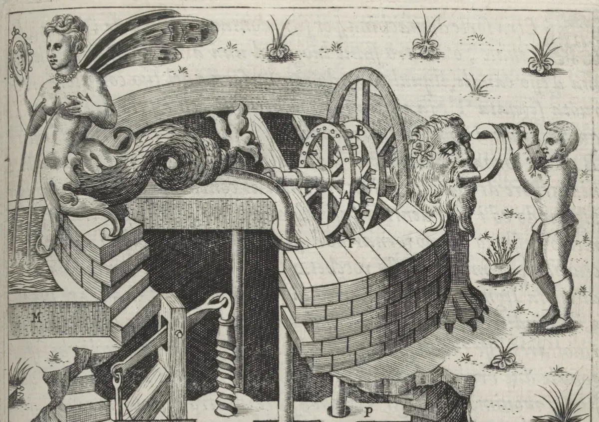
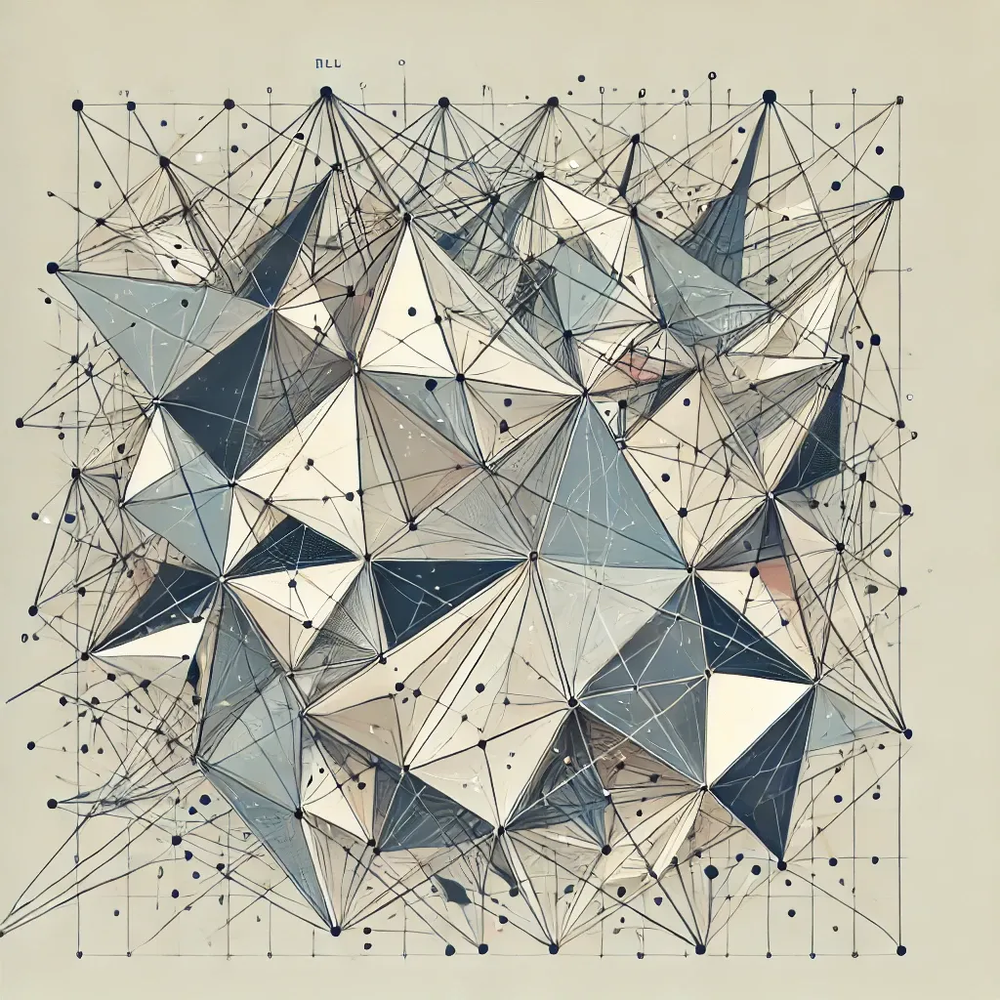
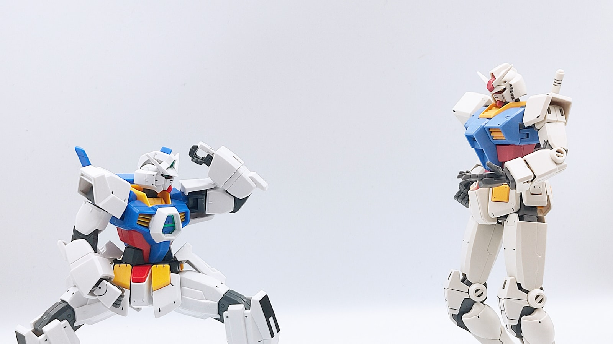
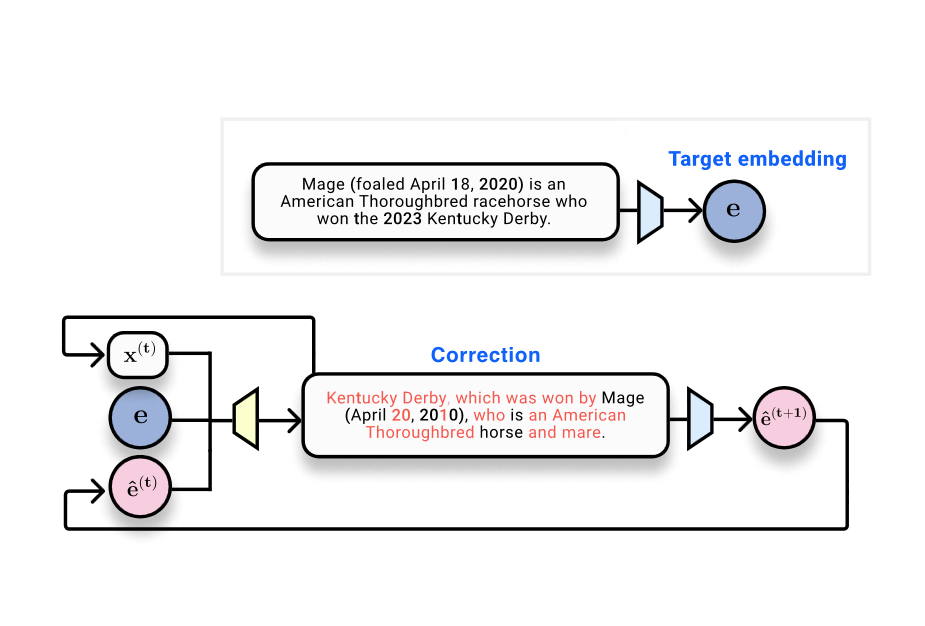
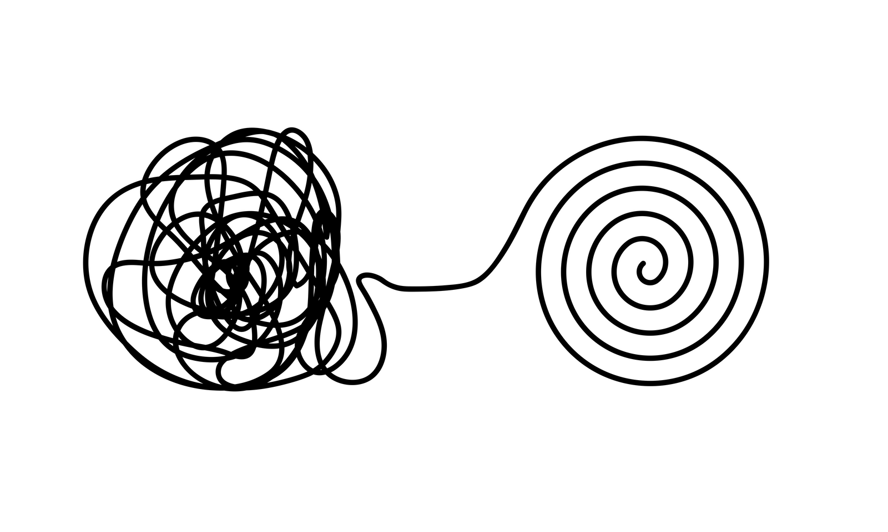

# The Gradient
> 发布时间: 2026-02-18
> 原文链接: https://thegradient.pub/

---

[Ethics](https://thegradient.pub/tag/ethics/)

## [After Orthogonality: Virtue-Ethical Agency and AI Alignment](https://thegradient.pub/virtue-ethics-ai-alignment/)

18.Feb.2026

[Peli Grietzer](https://thegradient.pub/author/peli/)

[Perspectives](https://thegradient.pub/tag/perspectives/)

## [AGI Is Not Multimodal](https://thegradient.pub/agi-is-not-multimodal/)

04.Jun.2025

[Benjamin A. Spiegel](https://thegradient.pub/author/superspeeg/)

[](https://pinterest.com/pin/create/button/?url=https://thegradient.pub/shape-symmetry-structure/&media=https://thegradient.pubhttps://thegradient.pub/content/images/2024/11/DALL-E-2024-11-15-15.40.52---Create-an-abstract-image-that-illustrates-how-ReLU-based-neural-networks-shatter-input-space-into-numerous-polygonal-regions--each-behaving-like-a-lin.webp&description=Shape%2C%20Symmetries%2C%20and%20Structure%3A%20The%20Changing%20Role%20of%20Mathematics%20in%20Machine%20Learning%20Research "Share on Pinterest")

## [Shape, Symmetries, and Structure: The Changing Role of Mathematics in Machine Learning Research](https://thegradient.pub/shape-symmetry-structure/)

16.Nov.2024

[Henry Kvinge](https://thegradient.pub/author/hkvinge/)

## [What's Missing From LLM Chatbots: A Sense of Purpose](https://thegradient.pub/dialog/)

09.Sep.2024

[Kenneth Li](https://thegradient.pub/author/kenneth/)

[Perspectives](https://thegradient.pub/tag/perspectives/)

## [We Need Positive Visions for AI Grounded in Wellbeing](https://thegradient.pub/we-need-positive-visions-for-ai-grounded-in-wellbeing/)

03.Aug.2024

[Joel Lehman](https://thegradient.pub/author/joel/) [Amanda Ngo](https://thegradient.pub/author/amanda/)

[LLM](https://thegradient.pub/tag/llm/)

## [Financial Market Applications of LLMs](https://thegradient.pub/financial-market-applications-of-llms/)

20.Apr.2024

[Richard Dewey](https://thegradient.pub/author/richard-dewey/) [Ciamac Moallemi](https://thegradient.pub/author/ciamac/)

[Ethics](https://thegradient.pub/tag/ethics/)

## [A Brief Overview of Gender Bias in AI](https://thegradient.pub/gender-bias-in-ai/)

08.Apr.2024

[Yennie Jun](https://thegradient.pub/author/yennie/)

[Deep Learning](https://thegradient.pub/tag/deep-learning/)

## [Mamba Explained](https://thegradient.pub/mamba-explained/)

27.Mar.2024

[Kola Ayonrinde](https://thegradient.pub/author/kola/)

[LLM](https://thegradient.pub/tag/llm/)

## [Car-GPT: Could LLMs finally make self-driving cars happen?](https://thegradient.pub/car-gpt/)

08.Mar.2024

[Jérémy Cohen](https://thegradient.pub/author/jeremy/)

[Interpretability](https://thegradient.pub/tag/interpretability/)

## [Do text embeddings perfectly encode text?](https://thegradient.pub/text-embedding-inversion/)

05.Mar.2024

[Jack Morris](https://thegradient.pub/author/jack/)

[Machine Learning](https://thegradient.pub/tag/machine-learning/)

## [Why Doesn’t My Model Work?](https://thegradient.pub/why-doesnt-my-model-work/)

24.Feb.2024

[Michael Lones](https://thegradient.pub/author/michael-lones/)

More Posts