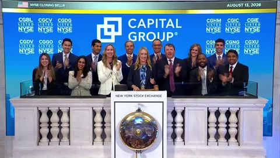

# U.S. Stock Market Headlines | Breaking Stock Market News
> 发布时间: 2026-08-14T16:14:00.34Z
> 原文链接: https://www.reuters.com/markets/us/

---

## Top U.S. Markets

| Index | Last | Change | % Change |
| --- | --- | --- | --- |
|
trading lower

[Dow Jones Industrial Average](https://www.reuters.com/markets/quote/.DJI/)

.DJI

 | 53,732.41 | \-107.58 | \-0.20%Negative |
|

trading lower

[Nasdaq Composite Index](https://www.reuters.com/markets/quote/.IXIC/)

.IXIC

 | 26,729.16 | \-73.86 | \-0.28%Negative |
|

trading lower

[S&P 500 Index](https://www.reuters.com/markets/quote/.SPX/)

.SPX

 | 7,785.76 | \-13.23 | \-0.17%Negative |

Source: [LSEG, opens new tab](https://www.lseg.com/en/data-analytics/financial-data/?utm_source=reuters.com&utm_medium=chartstable&utm_campaign=Reuters_DataCatalogPage_Links) - data delayed by at least 15 minutes

[See all](https://www.reuters.com/markets/stocks/us)

[BusinessCategory](https://www.reuters.com/business/)August 14, 2026

[WorldCategory](https://www.reuters.com/world/)August 14, 2026

August 13, 2026

August 13, 2026

## Markets Performance

[

Official Data Partner

](https://www.lseg.com/en?utm_source=reuters.com&utm_medium=lseglogo&utm_campaign=Reuters_LsegLogo_Links)

[

### Commodities

](https://www.reuters.com/markets/commodities)

| Future | Last | % Change |
| --- | --- | --- |
| [Brent Crude Oil](https://www.reuters.com/markets/quote/LCOc1/) | 88.82 | +0.34%Positive |
| [Gold](https://www.reuters.com/markets/quote/GCc1/) | 4,373.90 | +0.24%Positive |
| [Copper](https://www.reuters.com/markets/quote/MCCc1/) | 1,379.00 | +0.23%Positive |
| [CBOT Soybeans](https://www.reuters.com/markets/quote/Sc1/) | 1,176.25 | +0.88%Positive |

[

### Currencies

](https://www.reuters.com/markets/currencies)

| Exchange | Last | % Change |
| --- | --- | --- |
| [EUR/USD](https://www.reuters.com/markets/quote/EUR=X/) | 1.1569 | +0.35%Positive |
| [GBP/USD](https://www.reuters.com/markets/quote/GBP=X/) | 1.3530 | +0.33%Positive |
| [JPY/USD](https://www.reuters.com/markets/quote/JPYUSD=X/) | 0.0063 | +0.09%Positive |
| [CNY/USD](https://www.reuters.com/markets/quote/CNYUSD=X/) | 0.1483 | +0.01%Positive |

[

### Rates & Bonds

](https://www.reuters.com/markets/rates-bonds)

| Name | Yield | Change |
| --- | --- | --- |
| [US 10Y](https://www.reuters.com/markets/rates-bonds/) | 4.692 | \-0.004 |
| [DE 10Y](https://www.reuters.com/markets/rates-bonds/) | 3.212 | +0.012 |
| [UK 10Y](https://www.reuters.com/markets/rates-bonds/) | 5.043 | +0.004 |
| [JP 10Y](https://www.reuters.com/markets/rates-bonds/) | 2.88 | +0.004 |

[

### Stocks

](https://www.reuters.com/markets/stocks)

| Index | Last | % Change |
| --- | --- | --- |
| [S&P 500](https://www.reuters.com/markets/quote/.SPX/) | 7,785.76 | \-0.17%Negative |
| [Dow Jones](https://www.reuters.com/markets/quote/.DJI/) | 53,732.41 | \-0.20%Negative |
| [Nasdaq](https://www.reuters.com/markets/quote/.IXIC/) | 26,729.16 | \-0.28%Negative |
| [FTSE 100](https://www.reuters.com/markets/quote/.FTSE/) | 10,750.11 | \-0.21%Negative |

Source: [LSEG, opens new tab](https://www.lseg.com/en/data-analytics/financial-data/?utm_source=reuters.com&utm_medium=chartstable&utm_campaign=Reuters_DataCatalogPage_Links) - data delayed by at least 15 minutes

## Markets Now

## 来自 iframe: https://www.reuters.com/markets/us/

## 来自 iframe: https://www.reuters.com/markets/us/

More Videos

0 seconds of 0 secondsVolume 0%

Press shift question mark to access a list of keyboard shortcuts

Keyboard ShortcutsEnabledDisabled

Shortcuts Open/Close/ or ?

Play/PauseSPACE

Increase Volume↑

Decrease Volume↓

Seek Forward→

Seek Backward←

Captions On/Offc

Fullscreen/Exit Fullscreenf

Mute/Unmutem

Decrease Caption Size\-

Increase Caption Size\+ or =

Seek %0-9

Next Up

Investors should diversify beyond AI trade, says CIO

facebook linkedin x

Linkhttps://www.reuters.com/video/watch/idRW555214082026RP1/?chan=markets-now

Copied

Live

00:00

00:00

00:00

Markets NowAugust 14, 2026 · 11:57 PM GMT+1

Wall Street ends lower as investors weigh data, Middle East tensions

Wall Street's main indexes closed lower on Friday, with the S&P 500 dipping from a record high, as investors digested weaker-than-expected retail sales data. Lisa Bernhard reports.

### Up next

-   [Investors should diversify beyond AI trade, says CIO](#)

    [

    

    ](#)

-   [Retail sales hit by shrinking incomes, market expert says](#)

    [

    

    ](#)

-   [Market Talk: Can economic pressure reopen the Strait?](#)

    [

    

    ](#)

-   [S&P 500 notches record-high close as rate-hike worries ease](#)

    [

    

    ](#)

-   [Over-hyped market due for a pullback, investor says](#)

    

-   [Fed's 2% goal still tough despite 'benign' inflation data, expert says](#)

    

-   [Market Talk: UK growth rebound masks ‘sluggish’ outlook](#)

    

-   [S&P 500 ends higher as CoreWeave results fuel AI optimism](#)

    

-   [Expert urges investors to spread bets across the 'AI universe'](#)

    

[See all videos](https://www.reuters.com/video/markets-now/)

-   [Businesscategory](https://www.reuters.com/business/)·August 14, 2026

    [S&P 500 notches record-high close as rate-hike worries ease](https://www.reuters.com/business/retail-consumer/wall-st-futures-tick-higher-oil-retreats-ahead-inflation-data-2026-08-13/)

    The S&P 500 notched a record-high close on Thursday, fueled by advances in ​Sandisk and other heavyweight technology stocks, as tame producer price inflation data supported expectations the Federal Reserve ‌will not raise interest rates at its September meeting.

    

-   August 13, 2026

    [China's Lenovo posts 43% jump in first-quarter revenue, riding AI infrastructure boom](https://www.reuters.com/world/china/chinas-lenovo-posts-43-jump-q1-revenue-2026-08-13/)

    China's Lenovo Group reported a 43% jump in quarterly revenue on Thursday, beating forecasts to drive shares ​up as much as 22%, as the world's largest computer maker rides an AI hardware boom and benefits from a global ‌memory chip shortage.

    

-   August 13, 2026

    [Treasury Wine shares notch 8-month closing high on stable earnings outlook](https://www.reuters.com/world/asia-pacific/treasury-wine-hurt-by-weak-americas-business-posts-42-drop-annual-profit-2026-08-12/)

    Treasury Wine Estates said on Thursday it expects annual operating earnings to be at least in line with the previous financial year after a 36% drop in 2026, easing investor concerns ​and helping its shares close higher after early losses.

    

-   [Worldcategory](https://www.reuters.com/world/)·August 13, 2026

    [Venezuela looks to UK-held gold reserves for reconstruction as inflation surges](https://www.reuters.com/world/americas/venezuela-inflation-grows-199-july-central-bank-says-2026-08-12/)

    Venezuelan authorities plan to focus on reconstruction efforts and recovering gold ​reserves worth an estimated $4 billion held in the Bank ‌of England's underground vaults, National Assembly chief Jorge Rodriguez said on Wednesday, as monthly inflation surged to 20%.

    

-   ANALYSIS·August 12, 2026

    [Top US refiners see profits soar, step up investor rewards](https://www.reuters.com/business/energy/top-us-refiners-see-profits-soar-step-up-investor-rewards-2026-08-12/)

    Top U.S. fuel makers boosted returns to shareholders in the second quarter as prolonged disruptions to crude supplies through the ​Strait of Hormuz sent fuel prices and refining margins surging.

    

-   [Worldcategory](https://www.reuters.com/world/)·August 13, 2026

    [Brazil Congress approves spending curbs as debt concerns mount](https://www.reuters.com/world/americas/brazil-pushes-spending-curbs-bill-before-congress-debt-concerns-mount-sources-2026-08-12/)

    The Brazilian Congress approved ​on Wednesday spending-control mechanisms proposed by the government in an effort to rein in the ‌country's debt.

    

-   [Businesscategory](https://www.reuters.com/business/)·August 13, 2026

    [S&P 500 ends higher as CoreWeave results fuel AI optimism](https://www.reuters.com/business/wall-st-futures-tick-up-heading-into-july-inflation-data-2026-08-12/)

    The S&P 500 and the Nasdaq ended higher on ​Wednesday, lifted by upbeat quarterly results from CoreWeave and other AI infrastructure firms, while mild inflation data reinforced bets ‌that the U.S. Federal Reserve will hold interest rates steady in September.

    

-   ANALYSIS·August 12, 2026

    [Investors worry leaner Fed guidance may come at a price](https://www.reuters.com/business/finance/investors-worry-leaner-fed-guidance-may-come-price-2026-08-12/)

    Investors are questioning whether Federal Reserve Chairman Kevin Warsh can successfully unwind decades of communicating its monetary policy intentions without exacting a price from financial markets.

    

Loading...

Load more articles

## 来自 iframe: https://www.reuters.com/markets/us/

[

](https://adssettings.google.com/whythisad?source=display&reasons=AcFEiJWSh-lXZKCWuOIs1DTkxtUHk5Rd4Ho9nadduap0m7q_yawr3YYUZ4zL2uGQvYk8VtzMfD2PC85o31UP_6nwZQ-HwAQ_B1EnbUNvTR0Au-KMeOcivQyMMbYTDCl6PkIxMI4ODErUcKP_c7PQ9uUrNEXCdQkA26E9mzNbeWPjBvWtcyFE5d7Rh-Pu-LumE7XzMXnS78m3jkxxghROanYJl9tVrF-h_jG59dWoyu3siWF8O_2fZAs0fTsmm0Mfo8I25kI3AmM8h--0_e1zjr__4emJ1rzHoXPutCwvuIdGxInLnOpD_vAVHdMeRWu2Y1_kpqGjr_hBC60yaX-MDmWJ2Q_aYkXozLtgEV8v30J3kCfSKgbSna4ADlPOWRs2VB3euSr0RBNqoPmvVQlJl725O8NT00Seae6F_EYnkTA0qqNyZqmHD5lH3Js0A19UgcuCRx0IFDWFjgq2byZVBqeSJJCpgU8q2IN4P-wJkXNVsr6ovroYiksY7aytZT11kNnnkJ2USYaM2NV6t5-JFL0CBRQc-qJNjeOW4GCIMmC2_u1L-IUwynLceO9lglFGqiqOud1zjGdSN6xbvTzOenvpETA5p5cA3V67VKJ3PoJWgYVi40E5I5FrmhlZ85Dts6EUeOjeH2ntTV9PpeZbz8nMSiWySoBT4A-VYIfzc8G7AdMH9dqdEaNBQYitJwHAyDyKetRdgtw1hQrf6KVAGY7tTHKTmU8b-_ZQMXG6mX55G1MPh5g-vUOnEaxXzhUBPyQ3nAh-y1Mr2mRPCDxcGvjai2YXLeYPDOJZYdKsI42EL16YZ9SxiDqvjwb-hBf0-zFNC5kJcaAuHSbUZNKKlY6Ud56xUHX4a8GftYwfA_bIl9VOIpilO-YFAHylF4dzzKjRa1r_FF0naJzGqRXmomewhV7YJSfEWzojTSnY75I5JkR4VBLoz249kt7apYAr857CQyvoPE-xrCdoioVzWIPRMpmDX_AzFjHpnNeD8NaXG0-1Q6buHnimbjM_EUVdnZ9ZGwYFXEy7tcke97tTcxtpzgHH2nnNqRKPyoz1hpGCvyNP7nysOGk2em_VHDwZFHoKIu7w0A0P6_7WhZBPUgxgxf3D0b3FfJTV4mlASJXgX0Il3rOd3QH_JAXLkZP6IAXqHqn6d2K0kLuaL3bZGyqjuixlfZVKioq5R9ZGwnwqwe4Ei0QsSRb5y691h2CuPstMuJ_03ZE505NZRXKN3C5-Sy65_zb_XaK9wKhxXCio9MdN3L2wMXa4iLj7LfFfIl6nGc9Voj5UY0lYeyCpow8rwYzgSLkWDTh7qtMY8v5ulX3pCcS6Kxgm9odLo7_J3gVSFFLhefQjrHI9pMH3zFyMikusi4aC65RUOBFQ31YVSVIoTHcqIcAmQHI7Jh9kudNvX_KDxg&opi=122715837)